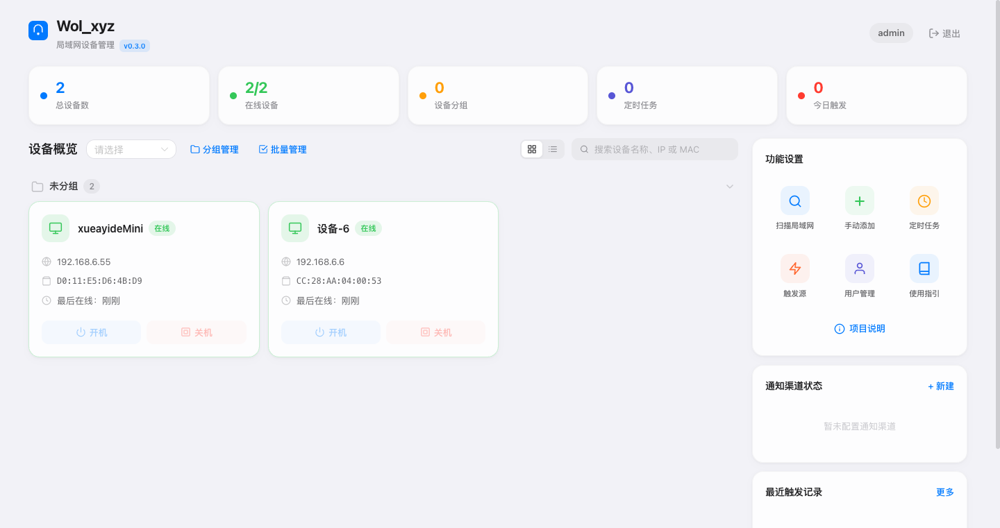

# Wol_xyz - 局域网设备管理

一个轻量级的局域网设备远程管理工具，提供 Web 管理面板，支持 Wake-on-LAN 远程开机、SSH 远程关机、设备状态监控、定时任务和多渠道通知。

## 项目展示



## 功能特性

- **多设备管理**：通过卡片式界面管理所有局域网设备
- **设备类型识别**：OUI 指纹自动推测 + 路由器 DNS 反向解析获取设备名，支持手动选择（Windows/macOS/Linux/iPad/iPhone/Android/NAS/路由器等）
- **设备分组**：按办公设备、家庭设备等自定义分类
- **批量管理**：全选/批量删除/批量移动分组
- **实时状态监控**：ICMP Ping 定期检测设备在线状态，WebSocket 实时推送，双次确认防误判
- **局域网扫描**：UDP 广播 + ARP 表发现设备，自动获取设备名称和类型，过滤已添加设备
- **远程开机**：WOL 魔术包唤醒（需目标设备开启 WOL）
- **远程关机**：SSH 连接执行关机命令（支持密码和密钥对认证，自动适配 Windows/Linux/macOS 关机指令）
- **定时任务**：可视化频率配置（每天/每周/每月），替代原始 cron 表达式
- **外部触发源**：
  - 巴法云（Bemfa）TCP 协议 — 支持米家/小爱语音控制
  - API Token — 通用 REST 接口，可对接 Home Assistant 等平台
  - MQTT — IoT 标准协议，支持 Home Assistant 等智能家居平台
  - Telegram Bot — 交互式设备管理（查看状态/开关机/扫描/日志）
- **通知渠道**：邮件（SMTP）、Webhook（内置飞书/企业微信模板）、Telegram，支持多实例
- **通知类型**：可按渠道独立配置「触发通知」和「任务成功通知」（设备状态确认）
- **触发源状态监控**：侧边栏实时显示触发渠道连接状态（在线/连接中/离线/禁用）
- **代理配置**：支持 HTTP/SOCKS5 代理，可在设置面板中手动配置，用于 Telegram 等外部请求
- **时区控制**：通过 `TZ` 环境变量统一控制所有时间显示，默认 `Asia/Shanghai`
- **用户管理**：Web 面板内修改账号密码、重新生成 JWT 密钥
- **操作日志**：记录所有操作的成功/失败详情

## 快速开始

### Docker 部署（推荐，仅限 Linux）

> **注意**：macOS 不支持 Docker 的 host 网络模式，无法使用 Docker 部署。请使用下方「本地开发」方式运行。

创建 `docker-compose.yml` 文件：

```yaml
services:
  wol-xyz:
    image: xueayis/wol-xyz:latest
    container_name: wol-xyz
    network_mode: host
    restart: unless-stopped
    volumes:
      - ./data:/app/data
    environment:
      - WEB_PORT=39090
      - TZ=Asia/Shanghai
```

启动服务：

```bash
docker compose up -d
```

访问 `http://<宿主机IP>:39090`，默认账号 `admin` / `admin`（首次登录后请在「用户管理」中修改密码）。

> **重要**：使用 `network_mode: host` 确保 WOL 广播和局域网扫描正常工作。

### 从源码构建 Docker 镜像

```bash
# 克隆仓库
git clone https://github.com/xueayi/Wol_XYZ.git
cd Wol_XYZ

# 构建镜像
docker build -t wol-xyz:latest .

# 使用 docker-compose 启动（会自动使用本地构建的镜像）
docker compose up -d

# 或直接 docker run
docker run -d --name wol-xyz --network host \
  -v ./data:/app/data \
  -e TZ=Asia/Shanghai \
  wol-xyz:latest
```

### 环境变量

| 变量 | 默认值 | 说明 |
|------|--------|------|
| `WEB_PORT` | `39090` | Web 面板端口 |
| `PING_INTERVAL` | `60` | Ping 检测间隔（秒） |
| `TZ` | `Asia/Shanghai` | 时区，影响所有时间显示（如 `America/New_York`、`Europe/London`） |

> 默认管理员账号 `admin` / `admin`，JWT 密钥自动生成。均可在 Web 面板「用户管理」中修改。

### 本地开发

#### 后端

```bash
# 1. 克隆仓库
git clone https://github.com/xueayi/Wol_XYZ.git
cd Wol_XYZ

# 2. 创建并激活 Python 虚拟环境
python3 -m venv .venv
source .venv/bin/activate        # Linux / macOS
# .venv\Scripts\activate         # Windows

# 3. 安装后端依赖
pip install -r backend/requirements.txt

# 4. 启动后端（开发模式，自动重载）
#    可选：TZ=America/New_York 覆盖时区（默认 Asia/Shanghai）
uvicorn backend.app.main:app --reload --port 39090
```

#### 前端

```bash
# 新终端，进入前端目录
cd frontend

# 安装依赖
npm install

# 开发模式启动（带热重载）
npm run dev

# 或构建生产版本（输出到 frontend/dist/）
npm run build
```

前端开发服务器默认在 `http://localhost:5173`，API 请求会代理到后端 `:39090`。

> **提示**：后端需要 `iputils-ping`、`openssh-client`、`sshpass` 等系统工具才能正常执行 Ping 和 SSH 操作。macOS 通常已内置，Linux 可通过 `apt install iputils-ping openssh-client sshpass` 安装。

## 目标设备配置

### 远程开机（WOL）

#### Windows

1. **BIOS**：启用 Wake on LAN / PCI-E 唤醒
2. **设备管理器**：网卡属性 → 电源管理 → 允许唤醒；高级 → 启用「魔术封包唤醒」
3. **关闭快速启动**：控制面板 → 电源选项

#### Linux

1. **BIOS**：启用 Wake on LAN
2. **安装 ethtool**：`sudo apt install ethtool`
3. **启用 WoL**：`sudo ethtool -s eth0 wol g`（`eth0` 替换为实际网卡名）
4. **持久化**：编辑 `/etc/network/interfaces` 或创建 systemd 服务使其开机生效

#### macOS

1. 系统设置 → 节能 → 勾选「唤醒以供网络访问」
2. 仅支持有线以太网连接，Wi-Fi 下 WoL 不可用

### 远程关机（SSH）

1. **Windows**：启用 OpenSSH Server（设置 → 应用 → 可选功能）
2. **Linux / macOS**：通常自带 SSH，确保 sshd 已启用
3. 确保 SSH 端口 22 未被防火墙阻止
4. 在 Web 面板中将设备类型设置为 Windows / Linux / macOS，然后启用远程关机
5. 支持两种认证方式：**密码认证**（通过 `sshpass`）或 **SSH 密钥对认证**（粘贴 PEM 格式私钥）

## 外部触发

### API

```bash
# GET 方式
curl "http://<IP>:39090/api/external/trigger?token=YOUR_TOKEN&mac=AA:BB:CC:DD:EE:FF&action=wake"

# POST 方式
curl -X POST "http://<IP>:39090/api/external/trigger?token=YOUR_TOKEN&device_id=1&action=shutdown"
```

#### Home Assistant 集成示例

在 Home Assistant 的 `configuration.yaml` 中添加：

```yaml
# REST 命令方式
rest_command:
  wol_xyz_wake:
    url: "http://<WOL_XYZ_IP>:39090/api/external/trigger"
    method: GET
    params:
      token: "YOUR_TOKEN"
      mac: "AA:BB:CC:DD:EE:FF"
      action: "wake"
  wol_xyz_shutdown:
    url: "http://<WOL_XYZ_IP>:39090/api/external/trigger"
    method: GET
    params:
      token: "YOUR_TOKEN"
      mac: "AA:BB:CC:DD:EE:FF"
      action: "shutdown"
```

在自动化中使用：

```yaml
automation:
  - alias: "回家自动开机"
    trigger:
      - platform: zone
        entity_id: person.me
        zone: zone.home
        event: enter
    action:
      - service: rest_command.wol_xyz_wake
```

> **提示**：也可通过 Shell Command 集成调用 curl 命令，适用于更复杂的场景。

### 巴法云

在触发源管理中配置巴法云 UID 和 Topic，即可通过米家/小爱语音控制设备开关机。

### MQTT

配置 MQTT Broker 地址和 Topic，发送 `on`/`off` 消息触发设备操作。支持与 Home Assistant 的 MQTT 集成联动，通过 HA 自动化控制设备。

### Telegram Bot

1. 通过 [@BotFather](https://t.me/BotFather) 创建 Bot 并获取 Token
2. 在触发源管理中添加 Telegram 类型并填入 Token
3. 可开启「同步通知渠道」让 Bot 同时作为通知推送渠道
4. 在 Telegram 中与 Bot 对话即可管理设备

支持的命令：

| 命令 | 功能 |
|------|------|
| `/start` | 显示主菜单和功能按钮 |
| `/devices` | 查看所有设备状态，点击按钮开关机 |
| `/groups` | 查看设备分组 |
| `/scan` | 扫描局域网 |
| `/logs` | 查看最近操作日志 |

## API 文档

启动服务后可访问自动生成的交互式 API 文档：

| 地址 | 说明 |
|------|------|
| `http://<IP>:39090/docs` | Swagger UI（可直接测试接口） |
| `http://<IP>:39090/redoc` | ReDoc（阅读友好） |
| `http://<IP>:39090/openapi.json` | OpenAPI JSON Schema |

## 技术栈

- **后端**：FastAPI + SQLAlchemy + APScheduler + paho-mqtt
- **前端**：Vue 3 + Naive UI + Pinia + Vite
- **数据库**：SQLite
- **部署**：Docker (host 网络模式) + GitHub Actions CI/CD

## License

MIT
